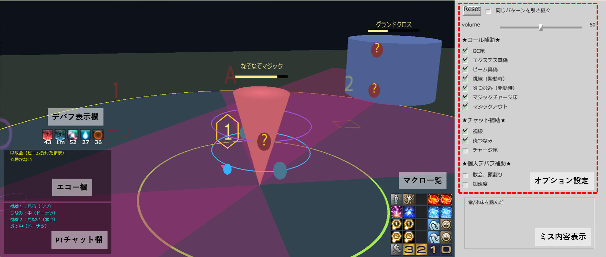
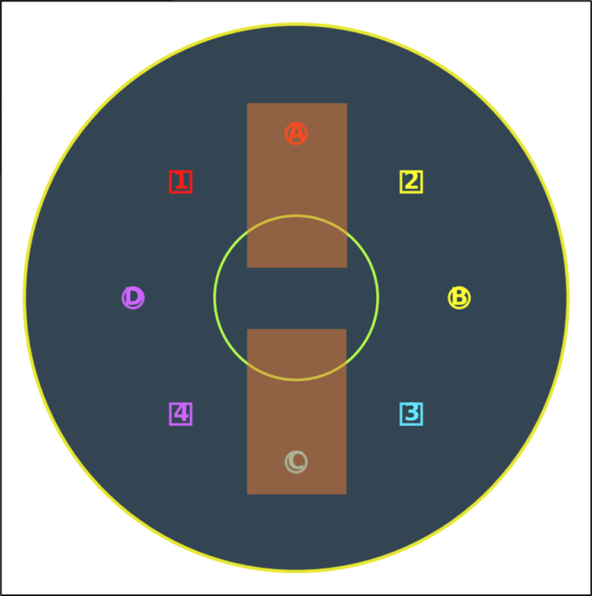
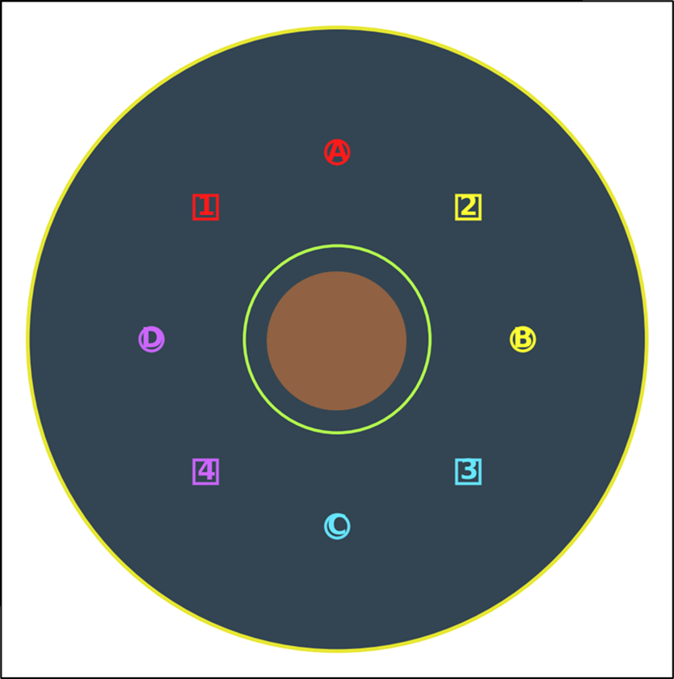

# 絶妖星乱舞 P4シミュレーター

絶妖星乱舞のP4をイメトレするためのシミュレーターです。

マクロは**早散会に1マーカー、遅散会に2マーカーをつける、1回目の散会はネオエクスデス基準とする処理**を採用しています。 
 
マクロ各種、コール音声は、こちら準拠で作成しています。
- [マクロスライド](https://docs.google.com/presentation/d/13sjWPxBr045OW5BimoZ-_A4v09Y4sbB55Y8tsz_P3C4/edit?usp=sharing)
- [コール、役割分担表](https://docs.google.com/spreadsheets/d/1IWxfFcFAbkx_LCHglqFvIA01GUntmq5s8utwo52qTug/edit?usp=sharing)

## 👇**ダウンロード**
**キーボード＋マウスver：[DL](https://github.com/asahipon/Dancing-Mad-Ult-P4-Simulator/releases/download/v0_beta/DMU_P4_sim_v0_beta.zip)** 
**パッドver：[DL](https://github.com/asahipon/Dancing-Mad-Ult-P4-Simulator/releases/download/v0_beta/DMU_P4_sim_pad_v0_beta.zip)** 

## 操作方法

### キーボード＋マウス

- **移動：** WASDキー
- **カメラ移動：** 右ドラッグ
- **その他操作：** 左クリック

### パッド

- **移動：** 左スティック
- **カメラ移動：** 右スティック
- **その他操作：** 左クリック

> **※クロスホットバー等の実装が難しかったため、マクロ操作はマウスのみとなっています。**  
> パッドを動かしながらマウス操作はちょっと……という方は、後述する補助機能を使い、マクロ押下はイメージで補ってください。

## 画面説明

  

## オプション設定詳細

| 項目 | 説明 |
| --- | --- |
| **Resetボタン** | もう一度やり直したいときに。押すごとに新しいパターンがランダムに生成される。 パターンをリセットしたくない時は、右にチェックを入れておくと、同パターンでやり直しができる。 |
| **Volume** | 補助音声の音量調節。 |
| **コール補助** | 固定で行う予定のコールに相当する音声を流す。 自分自身でコールの練習をしたい、コールのない野良を想定したい等、不要な場合はチェックを外す。 |
| **チャット補助** | 固定で流す予定のPTチャットを自動で流す。 自分自身でマクロを押す練習をしたい等、不要な場合はチェックを外す。 |
| **個人デバフ補助** | 全員につくデバフ（雷/水と加速度）に応じたエコーマクロを、自動で押す。 大体デバフがついた2秒後に表示。 練習の導入として補助を用いたい、パッドなのでマウス操作ができない等、必要な場合はチェックを入れる。 |

> **コールやマクロを担当していない人は、起動時の状態でOKです。**  
> 担当者は、担当している箇所のみチェックを外すと、固定時の状況を模擬できます。

## 注意事項・補足

> **タイムライン、判定タイミング、発動タイミングなど、実際のゲームとのズレが多々あります。**  
> 本シミュレーターは、あくまで動きの概要を掴むイメトレ用のため、「どこまで粘れるか」等の判断には適していません。

<b>頭割り / 散会判定について</b>

 

頭割り/散会判定はかなりおおざっぱで、

**基準の南北のマーカー少し外～中央付近にいれば頭割り、それ以外の場所にいれば散会**

と判定しています。

  

例えばAC頭割りの時、散会担当の位置が、1/2/3/4マーカーより内側に寄ると頭割り組に当たってしまうことがあるが、そういった厳密な立ち位置の判定はしていません。

プレイ動画等で確認してください。

<b>視線判定について</b>

 

視線判定は、

- フィールド中央に対して、前後どちらを見ているか判定  
  （実際は叫声デバフ対象者に対して）
- プレイヤー周りを180度で切って、前後として判定  
  （実際は前方60度が見る判定？たぶん）

としているため、ゲーム内と若干挙動が異なります。

<b>叫声デバフについて</b>

 

叫声デバフは、以下の画像くらいの範囲の中にいるか / 外にいるかで判定します。

  

本来、デバフ未所持者は正しい方向に向いてさえいればOKなのだが、関係ない人はタゲサ内に入らないを徹底したほうがいいので、**デバフがないのに範囲に入っているとMISSとする仕様**にしています。

<b>死者 / アラガンとビームについて</b>

 

死者/アラガンとビームを受けたときのデバフ表示が、実際のゲーム画面と異なります。

本当はビームを受けた瞬間に消えたり、受けたビームの色に変化したりするが、一律で表示を固定。

**正しいビームを受けることができたかのみを判定**します。

<b>ほのお / つなみについて</b>

 

ほのお/つなみについては、本来はデバフが切れる瞬間のプレイヤーの位置にダイナモ/チャリオットを生成するギミックだが、

- デバフが切れる瞬間に中央付近にいるか。いなければミス判定
- ↑をミスしていたとしても、一律でフィールド中央基準のダイナモ/チャリオットを生成し、安置に行けたかを判定

としています。

**設置をミスしても継続して練習できる仕様**です。

---

2026/8/30　あさひ